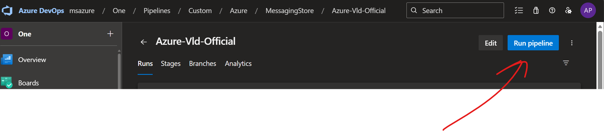
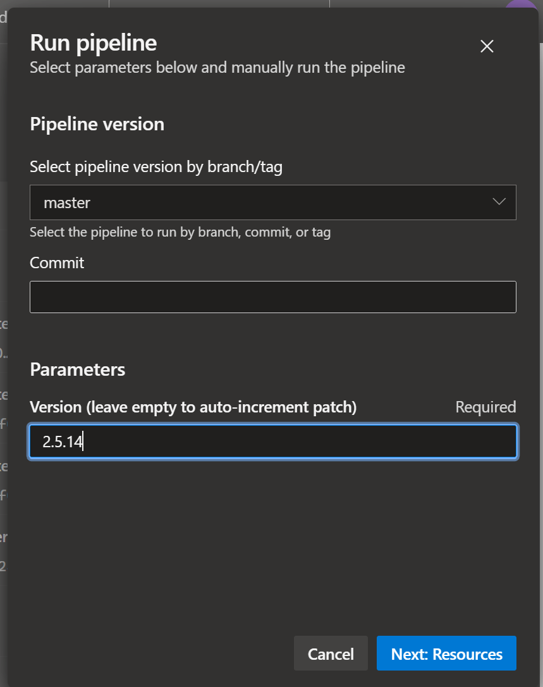

This document briefly describes how to build the official releases of VLD and get the release published to GitHub.

Step 1: go to [Azure-Vld-Official](https://msazure.visualstudio.com/One/_build?definitionId=445840)

Step 2: Click on "Run Pipeline"

Step 3: Select "master" as the branch you want to build from, write the next version and click on "Next: Resources"

Step 4: Click "Run" and wait for the build to finish. It should create everything if the build passes, including updating the version, the GitHub release etc.